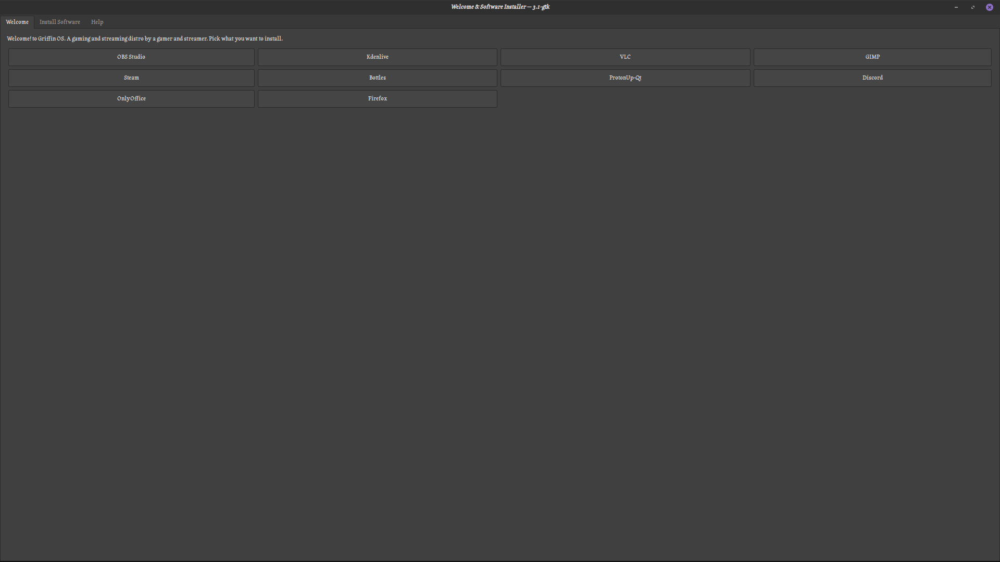
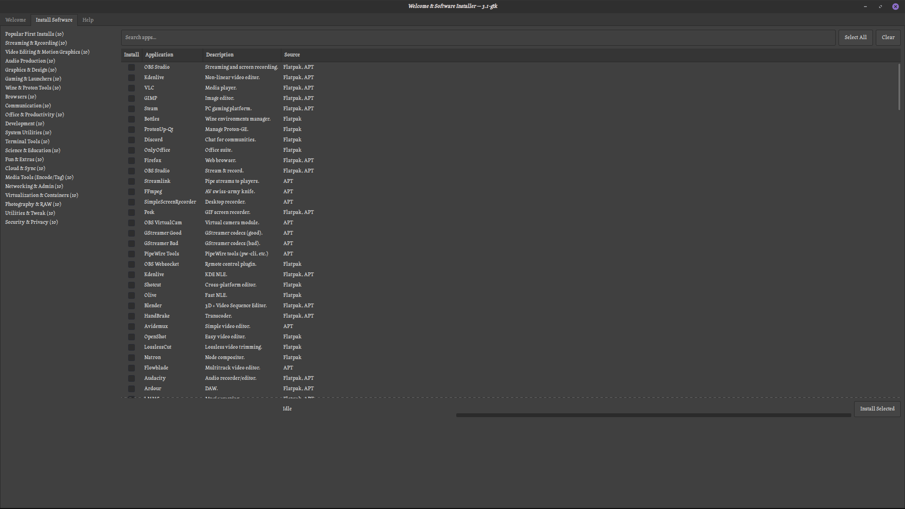

# Griffin-welcome
A welcome tool for Griffin OS




# Griffin OS Welcome Tool

The **Griffin OS Welcome Tool** is a first-boot and system setup application for **Griffin OS**.  
It provides a **friendly, graphical interface** for users to quickly install common applications, configure performance settings, and adjust system behavior without needing the terminal.  

Designed for:
- Gamers  
- Streamers  
- Content creators  
- Everyday Linux users (especially Windows converts!)  

---

## Features

- **Welcome Screen**: introduction to Griffin OS and its unique features.  
- **First Boot Autostart**: runs once after installation, then removes itself automatically.  
- **Application Installer**: lets you install recommended apps (Bottles, OBS Studio, etc.) with one click.    
- **No Terminal Needed**: everything is GUI-driven — though power users still have full control. The terminal is only needed when you want to install drivers or address rare issues.

---

## Installation

### 1. Add the Griffin OS Repository
```
echo "deb [arch=amd64,i386 signed-by=/etc/apt/keyrings/griffin.gpg] https://bobbycomet.github.io/griffin-repo stable main" | sudo tee /etc/apt/sources.list.d/griffin.list
```

```
sudo mkdir -p /etc/apt/keyrings
wget -O- https://bobbycomet.github.io/griffin-repo/griffin.gpg.key | sudo tee /etc/apt/keyrings/griffin.gpg
```

```
sudo apt update
sudo apt install griffin-welcome
```
